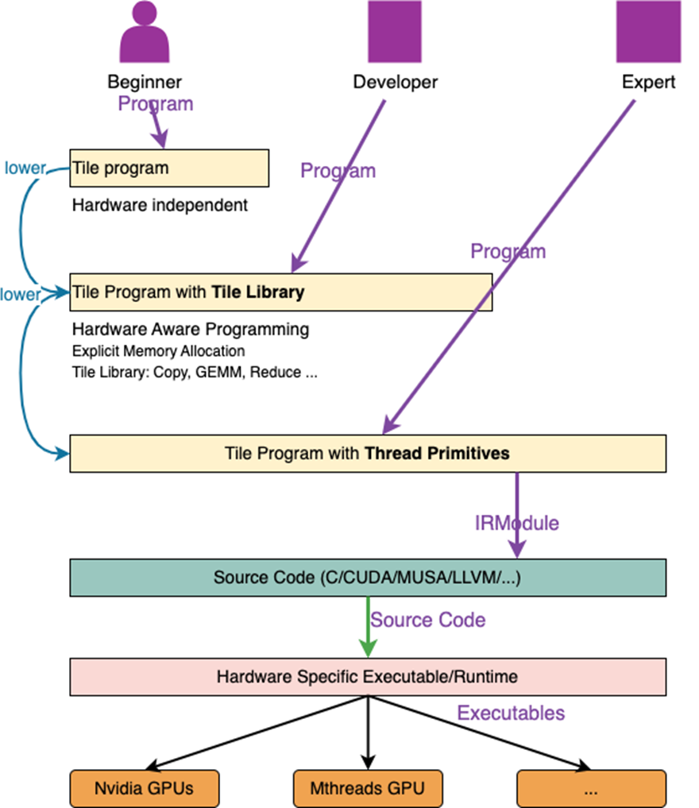

# Tilelang介绍

TileLang([https://tilelang.com/index.html](https://tilelang.com/index.html)) 是一种简洁的基于tile的领域特定语言，旨在增加高性能GPU/CPU算子的开发效率，相关算子包括GEMM，Dequant GEMM, FlashAttention, LinearAttention等。TileLang采用python语法，并且基于TVM构建底层编译器，使得开发人员可以轻松实现一流性能所需要的底层优化，从而更加专注于算子开发效率。

TileLang-MUSA([https://tilelang.com/index.html](https://github.com/MooreThreads/tilelang_musa)) 是TileLang在摩尔线程（Moore Threads）MUSA 架构上的深度适配，包含 DSL 编程语言、JIT 编译器、运行时系统及预优化算子库。除了深度兼容TileLang本身的API和语言特性之外，TileLang-MUSA还推出了MUSA扩展，方便开发者更好的写出高性能MUSA算子。

Tilelang MUSA 通过 分层编程模型 + 硬件感知编译 + 自动调优 三位一体方案实现Tilelang在MUSA架构的深度适配：



三层编程接口：

- 入门级：无需了解硬件，用高层张量表达式编写算法。
- 开发者级：使用预定义 Tile Library（如 `T.gemm`, `T.copy`）快速构建 kernel。
- 专家级：直接操作线程原语（warp、barrier、shared memory），进行极致优化。

硬件抽象与自动映射：

- 根据不同的架构 `T.gemm` 自动转换为 SQMMA 指令或 WMMA 指令，
- `T.copy` 自动转换为 TME（Tensor Memory Extension） 指令或 global↔shared 专用搬运指令，
- `mbarrier` 原语在平湖上编译为 ASYNC barrier，支持异步流水。

端到端编译链：
- 源码 → Tile IR → MUSA ASM → 可执行 kernel;
- 复用现有 MUSA 工具链，兼容 `nvrtc` 式 JIT 流程。

## 核心特点

| **特性** | **说明** | **开发者价值** |
| --- | --- | --- |
| ✅ **分层编程模型** | Beginner / Developer / Expert 三级接口 | 按需选择抽象层级，兼顾易用性与控制力 |
| ✅ **MUSA 原生支持** | 已适配 **曲院**（Quyuan）与 **平湖**（Pinghu）两代架构 | 无需重写代码即可跨代际部署 |
| ✅ **硬件特性抽象** | 支持 TME、ASYNC、TCE、LDLMS 等平湖特有指令 | 自动利用高带宽异步搬运与 Tensor Core |
| ✅ **丰富算子库** | 覆盖 Elementwise、Reduction、GEMM、FA、MoE 等 50+ 算子 | 快速构建 Transformer、LLM 等模型 |
| ✅ **高性能** | GEMM 达 手写最佳实现的 95%，FA3 达到手写最佳实现的85% | 能够兼顾性能与开发效率 |
| ✅ **自动调优** | 内置 autotuner 与 layout profiler | 自动搜索最优 tile size、内存布局、循环展开策略 |

---

# 架构原理

## 软硬件架构图（抽象版）

```plaintext
+--------------------------------------------------+
|                  User Application                |
|        (PyTorch / Custom Deep Learning Model)    |
+---------------------------+----------------------+
                            |
                            v
+--------------------------------------------------+
|              Tilelang High-Level API             |
|      tl.gemm() / tl.flash_attention() / etc.     |
+---------------------------+----------------------+
                            |
                            v
+--------------------------------------------------+
|                Tilelang JIT Compiler             |
|                                                  |
|  Python Frontend                                 |
|      ↓    (Tilelang Frontend Compiler)           |
|  Auto-Scheduling · Fusion · Vectorization        |
|      ↓                                           |
|  Optimized MUSA C Kernel                         |
|      ↓    (MUSA Compiler)                        |
|    Mubin                                         |
+---------------------------+----------------------+
                            |
                            v
+--------------------------------------------------+
|               MUSA Runtime & Driver              |
|                                                  |
|  • Kernel Launch                                 |
|  • Grid / Block Configuration                    |
|  • Memory Allocation & Synchronization           |
+---------------------------+----------------------+
                            |
                            v
+--------------------------------------------------+
|                 MUSA GPU Hardware                |
|                                                  |
|  • Tensor Cores                                  |
|  • Shared Memory / L2 Cache                      |
|  • Warps / SMs / Pipelines                       |
+--------------------------------------------------+


```

实现逻辑说明

*   编译路径：基于 `codegen_musa.cc` 实现，新增 `MUSA TARGET`，复用 NVIDIA 兼容流程；

*   原语映射：

    *   `tl.copy(src, dst)` → 平湖：TME 指令；曲院：专用 LD/ST 指令；

    *   `tl.gemm(a, b)` → 平湖：TCE（Tensor Core Engine）；曲院：FMA 序列；

    *   `tl.mbarrier` → 平湖：ASYNC barrier，支持异步数据就绪通知；

*   内存模型：显式 shared memory 分配 + 自动 bank conflict 优化。


# 快速入门

## 环境准备

- 支持 MUSA 架构的 GPU（如 MTTS series）
- 安装 MUSA SDK 4.3.0 及以上版本
- Python ≥ 3.8
- 运行时需要当前 Python 环境有 torch_musa


## 安装

### 官方源安装

```python
mc cp sh-moss/sw-daily/musa/master/2026-01-30/tilelang_musa-0.1.6.post2+musa.1-cp38-abi3-linux_x86_64.whl .
pip install tilelang_musa-0.1.6.post2+musa.1-cp38-abi3-linux_x86_64.whl
# 验证安装
python -c "import tilelang; print(tilelang.__version__)"
```

### 从源码安装 

和 Tilelang 官方安装方式一致

```cpp
git clone https://github.com/MooreThreads/tilelang_musa.git
cd tilelang
conda create -n tilelang-main python=3.10
conda activate tilelang-main
pip install -r ./requirements-dev.txt
export USE_MUSA=1
pip install -e . -v --no-build-isolation
```

## 基础用例测试

一两个case上手tilelang

### 示例 1：Elementwise Add

```py
import tilelang
import tilelang.language as T
import torch

# 禁用缓存, 调试查看 IR 需要使用
tilelang.disable_cache()

def elementwise_add(N, num_per_thread=8, threads=256, dtype="float32"):
    @T.prim_func
    def main(A: T.Tensor((N), dtype), B: T.Tensor((N), dtype), C: T.Tensor((N), dtype)):
        # 设置 grid size 和 block thread number
        with T.Kernel(T.ceildiv(N, threads * num_per_thread), threads=threads) as (b_x):
            # thread block 级别执行代码
            for i, j in T.Parallel(threads, num_per_thread):
                offsets = (b_x * threads + i) * num_per_thread
                C[offsets + j] = A[offsets + j] + B[offsets + j]
    return main

def ref_program(x, y):
    return x + y

N = 4096
# 获取 PrimFunc 并编译
program = elementwise_add(N)
kernel = tilelang.compile(program, out_idx=-1, execution_backend="cython", verbose=True)
# 打印 MUSA C 代码
print(kernel.get_kernel_source())

# 运行 Tilelang Kernel 并和 torch 比对结果
a = torch.randn(N, dtype=torch.float32, device="musa")
b = torch.randn(N, dtype=torch.float32, device="musa")

c = kernel(a, b)
torch.testing.assert_close(c, ref_program(a, b), rtol=1e-2, atol=1e-2)
```


# Tilelang DSL 语法与 API

## 语法

关于具体语法信息，可参考TileLang官网 [https://tilelang.com/programming\_guides/language\_basics.html](https://tilelang.com/programming_guides/language_basics.html)，Tilelang_MUSA 已支持绝大多数 Tilelang 语法

Tilelang 指令
[https://tilelang.com/programming\_guides/instructions.html](https://tilelang.com/programming_guides/instructions.html)
[https://tilelang.com/autoapi/tilelang/index.html](https://tilelang.com/autoapi/tilelang/index.html)


### 类型系统

目前除了float6, float4之外其余都支持, 具体参考 [https://tilelang.com/programming\_guides/type\_system.html](https://tilelang.com/programming_guides/type_system.html)

### 控制流

[https://tilelang.com/programming\_guides/control\_flow.html](https://tilelang.com/programming_guides/control_flow.html)

支持全部控制流语句，参考

```python
for i in T.serial(N):
    ...

for i, j in T.Parallel(M, N):
    C[i, j] = A[i, j] + B[i, j]

for k in T.Pipelined(T.ceildiv(K, BK), num_stages=3):
    # overlap copy/compute across stages
    ...
```

## API

### 性能分析：

[https://tilelang.com/autoapi/tilelang/profiler/index.html#module-tilelang.profiler](https://tilelang.com/autoapi/tilelang/profiler/index.html#module-tilelang.profiler)

```python
kernel = tilelang.compile(
    program,
    out_idx=-1,
    target=TARGET,
    execution_backend="cython",
)
profiler = kernel.get_profiler()
latency_ms = profiler.do_bench(
    n_warmup=n_warmup,
    n_repeat=n_repeat,
    backend=backend,
    quantiles=quantiles,
    return_mode=return_mode,
)
print(f"Latency: {latency_ms} ms")
```

### 自动调优：

[https://tilelang.com/autoapi/tilelang/autotuner/tuner/index.html#module-tilelang.autotuner.tuner](https://tilelang.com/autoapi/tilelang/autotuner/tuner/index.html#module-tilelang.autotuner.tuner)

TODO

## musa example

### musa gemm

```python
import tilelang
import tilelang.language as T
import torch
from tilelang.primitives.gemm.base import GemmWarpPolicy

def matmul(M, N, K, block_M, block_N, block_K, dtype="float16", accum_dtype="float"):
    @T.prim_func
    def matmul_kernel(
        A: T.Tensor((M, K), dtype),
        B: T.Tensor((K, N), dtype),
        C: T.Tensor((M, N), dtype),
    ):
        with T.Kernel(T.ceildiv(N, block_N), T.ceildiv(M, block_M), threads=512) as (bx, by):
            T.use_swizzle(panel_size=4, order='col')
            A_shared = T.alloc_shared((block_M, block_K), dtype)
            B_shared = T.alloc_shared((block_K, block_N), dtype)
            C_local = T.alloc_fragment((block_M, block_N), accum_dtype)
            T.clear(C_local)
            for k in T.Pipelined(T.ceildiv(K, block_K), num_stages=3):
                T.copy(A[by * block_M, k * block_K], A_shared)
                T.copy(B[k * block_K, bx * block_N], B_shared)
                T.gemm(A_shared, B_shared, C_local, policy=T.GemmWarpPolicy.Square)
            T.copy(C_local, C[by * block_M, bx * block_N])
    return matmul_kernel

def main():
    M, N, K, BLOCK_M, BLOCK_N, BLOCK_K = 8192, 7168, 16384, 256, 256, 64
    elem_type = 'torch.float16'
    device = "musa"
    A = torch.randn((M, K), dtype=torch.float16, device=device)
    B = torch.randn((K, N), dtype=torch.float16, device=device)
    program = matmul(M, N, K, BLOCK_M, BLOCK_N, BLOCK_K, dtype=get_tilelang_type(elem_type), accum_dtype="float32")

    pass_configs = {
        tilelang.PassConfigKey.TL_DISABLE_WARP_SPECIALIZED: False,
    }
    kernel = tilelang.compile(
        program,
        out_idx=-1,
        target="musa",
        execution_backend="cython",
        verbose=True,
        pass_configs=pass_configs,
    )
    ref_out = torch.mm(A, B)
    C = kernel(A, B)
    torch.testing.assert_close(ref_out.to(torch.float16), C.to(torch.float16), rtol=1.25e-1, atol=1.25e-1)

if __name__ == "__main__":
    main()

```

### musa flash-attention3

参考 musa_tests/flash_attention/example_mha_fwd_bhsd.py

# MUSA编程扩展与编程限制

## 编程扩展

| 关联接口 | 扩展内容 | 使用指导 |
| --- | --- | --- |
| T.kernel(xxx, producer\_threads=xxx) | 新增producer\_threads参数 | 开启warp\_specialize特性后，针对simt kernel，可以通过producer\_threads指定生产者线程数 |
| T.copy(xxx, disable\_tma=True, force\_async\_copy=True) | 新增force\_async\_copy参数 | 在不使用tme特性的前提下，可以通过force\_async\_copy使能ldlms特性 |

## 编程语法限制

TODO

# 调试诊断

## 调试打印

[https://tilelang.com/autoapi/tilelang/language/print\_op/index.html#module-tilelang.language.print\_op](https://tilelang.com/autoapi/tilelang/language/print_op/index.html#module-tilelang.language.print_op)

Tilelang 提供了 `print_op` 用于打印kernel内部变量，参考

```python
def debug_print_buffer(M=16, N=16, dtype="float16"):

    @T.prim_func
    def program(Q: T.Tensor((M, N), dtype)):
        with T.Kernel(4, 4, 2, threads=128 * 2) as (bx, by, bz):
            shared_buf = T.alloc_shared([M, N], dtype)
            T.print(shared_buf)

    jit_kernel = tilelang.compile(program, target="cuda")
    profiler = jit_kernel.get_profiler()
    profiler.run_once()
```

```python
def _manual_device_assert_triggered():

    @T.prim_func
    def program():
        with T.Kernel(threads=128):
            tid = T.get_thread_binding()
            T.device_assert(tid > 0, "Assertion Trigger !")

    jit_kernel = tilelang.compile(program, target="cuda")
    profiler = jit_kernel.get_profiler()
    profiler.run_once()
```

## 查看musa c代码（中间产物）

TileLang的编译过程会将kernel代码生成MUSA C代码，然后调用MUSA后端编译器编译成二进制文件，可以通过 `get_kernel_source` 接口打印MUSA C代码，参考

```python
def elementwise_add(N, num_per_thread=8, threads=256, dtype="float32"):
    num_per_block = threads * num_per_thread

    @T.prim_func
    def main(A: T.Tensor((N), dtype), B: T.Tensor((N), dtype), C: T.Tensor((N), dtype)):
        with T.Kernel(T.ceildiv(N, num_per_block), threads=threads) as (bx):
            sum = T.alloc_fragment((num_per_block), "float")
            # vector add.
            for i, j in T.Parallel(threads, num_per_thread):
                offsets = i * num_per_thread + j
                sum[offsets] = (
                    A[bx * num_per_block + offsets] + B[bx * num_per_block + offsets]
                )
            T.copy(sum, C[bx * num_per_block])

    return main


def ref_program(x, y):
    return x + y


N = 4096

program = elementwise_add(N)
kernel = tilelang.compile(
    program, out_idx=-1, target="musa", execution_backend="cython", verbose=True
)
print(kernel.get_kernel_source())
```

## 查看 IR

Tilelang 使用 TVM TIR, 如果想要查看 Pass 前后的 IR, 可以使用 TVM Instruments 机制

```py
from tvm.ir.instrument import PrintAfterAll

kernel = tilelang.compile(
    program, out_idx=-1, target="musa", execution_backend="cython", verbose=True, instruments=[PrintAfterAll()]
)
```


# 性能说明

## 性能实测数据（平湖架构，FP16）

| **算子** | **Tilelang MUSA** | **备注** |
| --- | --- | --- |
| GEMM (4096×4096) | 95% asm | 行业领先 |
| FlashAttention (seq=2048) | 85% asm | 行业领先 |

# 名词解释

| 术语 | 说明 |
| --- | --- |
| MUSA | Moore Threads Unified System Architecture，摩尔线程统一系统架构 |
| Tile | 计算分块单位，通常为 64×64 或 128×128 |
| Warp | MUSA 中的基本执行单元，每 warp 含 32 个线程 |
| Tensor Core | MUSA 上的专用矩阵计算单元，支持 FP16/BF16 MMA 指令 |
| Fused Kernel | 将多个操作合并为单个 GPU kernel，减少显存读写 |
